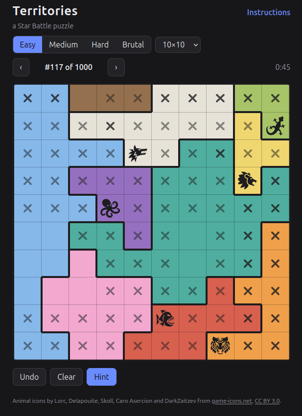

# Territories

A [Star Battle](https://en.wikipedia.org/wiki/Star_Battle) puzzle (the same puzzle as LinkedIn's "Queens"),
with an animal for each colored territory.
It runs entirely in the browser as a static page.

**[Play it here](https://jaredcorduan.github.io/territories/)**

<p align="center"></p>

## Rules

Each color is a territory.
Place one animal in every row, every column, and every territory.
Animals never touch, not even diagonally.

## Features

- Four levels (Easy, Medium, Hard, Brutal) on 7×7 to 10×10 grids, 1000 puzzles of each.
- **No guessing, ever.** Every puzzle has a unique solution, reachable using only its level's moves.
  A puzzle's level is the hardest move it needs. [MOVES.md](MOVES.md) lists them all.
- A hint button that shows the next move and explains it.
- Tap a cell to cycle blank → ✕ → animal; drag to paint ✕'s.
  Placing an animal automatically crosses out its "shadow".
- Pick your favorite animal for each color, or leave it random.

## Running it

You need [Rust](https://rustup.rs) and [wasm-pack](https://rustwasm.github.io/wasm-pack/).

```sh
./build.sh                      # build the WASM hint engine and the site's puzzle data
python3 -m http.server -d web   # then open http://localhost:8000
```

`web/` is then the complete static site. It needs an HTTP server because WASM won't load from `file://`.

## How it works

| Path | What it is |
| --- | --- |
| `crates/territories-core` | The moves, the solver that grades puzzles with them, and the hint engine |
| `crates/territories-gen` | The puzzle generator and its tools |
| `crates/territories-wasm` | Exposes the hint engine to the browser |
| `web/` | The game: plain HTML, CSS, and JavaScript |
| `data/puzzles.json` | The permanent puzzle collection |

The generator places a random valid set of animals, grows territories around them,
then repairs the territories until the solver can finish the puzzle using the moves alone,
which also proves the solution is unique.

## Development

- `cargo test --release` runs the tests, including soundness of the moves and uniqueness of solutions.
- `cargo run --release --bin farm` grows the collection.
  It runs on all cores until Ctrl-C, skips duplicates (including rotations and mirror images),
  and refreshes `web/puzzles.json` every 10 seconds.
  Add `-- --minutes 10` to stop after a set time, or `-- --target 1000` to stop once every size and level
  has 1000 puzzles.
- `cargo run --release --bin brutal-lab -- --check data/puzzles.json` regrades the collection and reports
  any puzzle whose stored level no longer matches.
- `dev/zoo/index.html` (open it directly) previews the candidate animals for each color.

## Credits

Animal icons by Lorc, Delapouite, Skoll, Caro Asercion and DarkZaitzev from
[game-icons.net](https://game-icons.net), [CC BY 3.0](https://creativecommons.org/licenses/by/3.0/).
